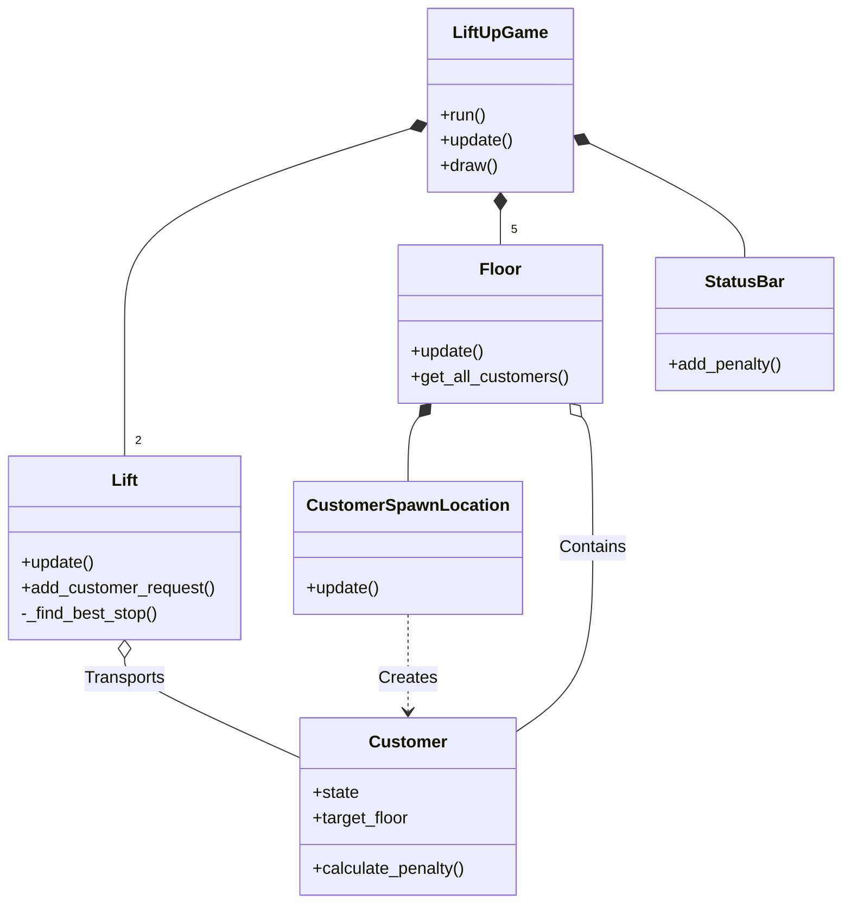
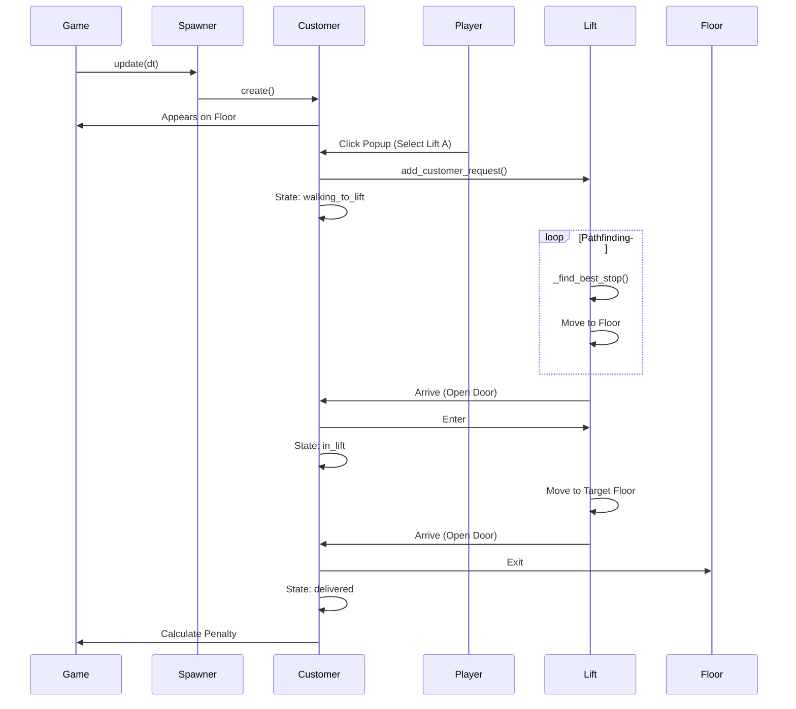
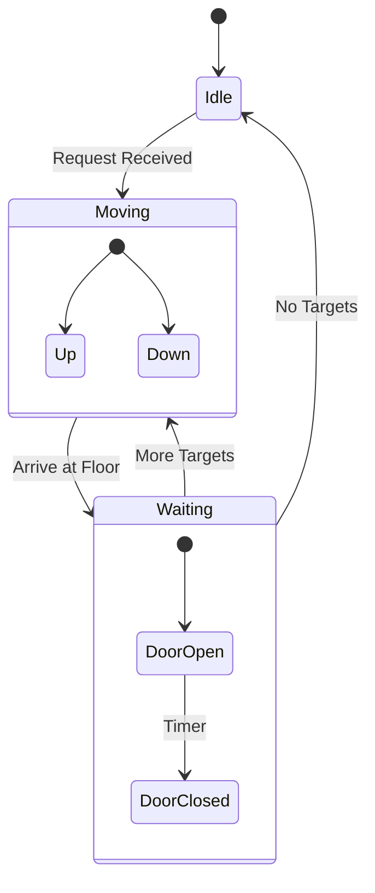

# Code Architecture

## Overview
The Lift Up Game is a Pygame-based simulation where the player manages elevators to transport customers between floors efficiently, minimizing penalties based on wait times.

## Key Components

### Main Game Loop (`main.py`)
- **`LiftUpGame`**: The central controller. Initializes Pygame, creates `Floor` and `Lift` objects, manages the event loop, and updates all game entities.
- **`StatusBar`**: Displays the total accumulated penalty at the bottom of the screen.

### Entities

#### Lift (`Lift.py`)
- Represents an elevator.
- **State Machine**: `idle`, `moving_up`, `moving_down`, `waiting` (door open).
- **Logic**: Uses a target sequence algorithm (`_find_best_stop`) to determine the most efficient path to serve requests and passengers.

#### Floor (`Floor.py`)
- Represents a building level.
- Contains `CustomerSpawnLocation`s.
- Manages customers currently on that floor (both spawning and those who arrived via lift).

#### Customer (`Customer.py`)
- Represents a passenger.
- **State Machine**: `waiting_for_lift_selection`, `walking_to_lift`, `waiting_at_lift`, `in_lift`, `exiting_lift`, `delivered`.
- **Attributes**: Priority (High/Normal), Target Floor, Penalty calculation logic.

#### Spawning System
- **`CustomerSpawnLocation.py`**: Manages timing for spawning customers on a specific floor.
- **`RandomCustomerFactory.py`**: Generates `Customer` instances with random attributes (target floor, priority).

### UI & Interaction
- **Popups**:
    - `FloorRequestPopup`: Allows player to assign Lift A or B.
    - `ServedCustomerInfoPopup`: Shows status while waiting.
    - `DeliveredCustomerPopup`: Shows final stats upon delivery.
- **Input**: Mouse clicks are detected in `main.py` and delegated to active customers/popups.

## Diagrams

### Class Diagram

### Customer Lifecycle Sequence

### Lift State Machine

