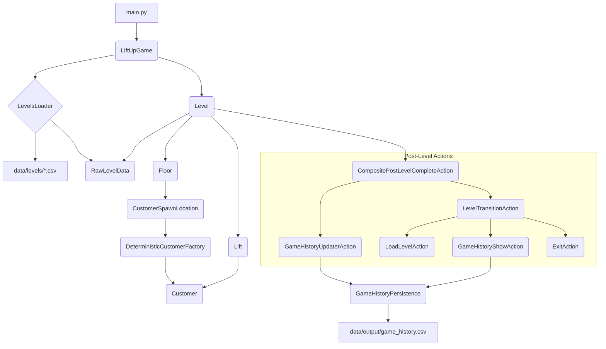
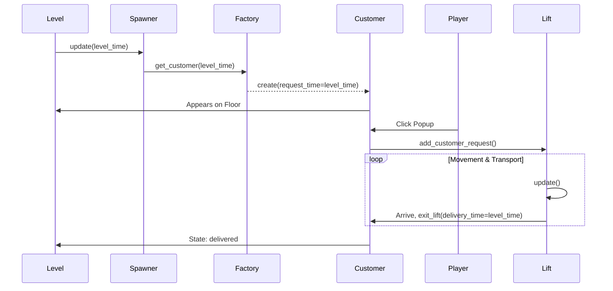

# Code Architecture

## Overview
The Lift Up Game is a simulation where the player manages elevators to transport customers between floors, aiming to minimize penalties based on wait times. The architecture is designed to be data-driven, allowing for easy creation of new levels.

## Core Components

### 1. Main Game (`LiftUpGame.py`)
- **`LiftUpGame`**: The main application class. It initializes Pygame, manages the main game loop, and orchestrates the loading and transitioning of levels.
- **`main.py`**: The entry point of the application that creates and runs a `LiftUpGame` instance.

### 2. Level Loading & Data
- **`LevelsLoader.py`**: Responsible for discovering and parsing level data from the file system (`data/levels/`). It checks for the existence of level files and loads them into structured data objects.
- **`Raw...Data.py`**: A set of simple data classes (`RawLevelData`, `RawCustomerData`, `RawSpawnLocationData`) that hold the parsed data from CSV files, ensuring a clean separation between file I/O and game logic.

### 3. Gameplay Logic
- **`Level.py`**: Encapsulates all logic for a single level. It manages its own game clock, floors, lifts, and the main update/draw cycle for a level's duration. It is initialized with a `RawLevelData` object.
- **`Floor.py`**: Represents a single floor, responsible for managing the `CustomerSpawnLocation`s on it and tracking customers who have arrived.
- **`Lift.py`**: Contains the state machine and logic for elevator movement, customer pickup/drop-off, and pathfinding via the `_find_best_stop` algorithm.
- **`Customer.py`**: Represents a passenger with states like `waiting`, `walking`, `in_lift`, and `delivered`. It also calculates its own penalty score.

### 4. Spawning System
- **`CustomerSpawnLocation.py`**: A point on a floor where customers are generated.
- **`DeterministicCustomerFactory.py`**: Reads a list of `RawCustomerData` and spawns customers at the correct time based on the level's clock.
- **`RandomCustomerFactory.py`**: A legacy factory for generating customers randomly (currently unused but kept for potential future game modes).

### 5. Post-Level Action System (`post_level/`)
This system defines what happens after a level is completed. It uses a command pattern to create a chain of actions.
- **`PostLevelCompleteAction.py`**: An abstract base class defining the `execute(level)` interface.
- **`CompositePostLevelCompleteAction.py`**: An action that holds a list of other actions and executes them in sequence.
- **`LevelTransitionAction.py`**: Displays a summary screen with the player's score for the completed level and provides navigation buttons (Next, Replay, etc.).
- **`LoadLevelAction.py`**: An action that tells the main `LiftUpGame` instance to load a specific level number.
- **`GameHistoryUpdaterAction.py`**: Saves the result of a completed level to the history file.
- **`GameHistoryShowAction.py`**: Displays the full, formatted game history screen after the final level.
- **`ExitAction.py`**: Signals the main game loop to terminate.

### 6. Data Persistence
- **`GameHistoryPersistence.py`**: Manages reading from and writing to `game_history.csv`, handling the serialization of game results.
- **`RawGameHistoryEntry.py`**: A data class representing a single row in the history file.

## Diagrams

### High-Level Architecture

### Customer Lifecycle

